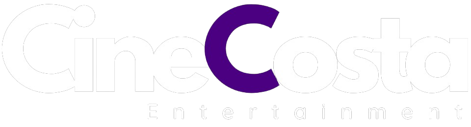
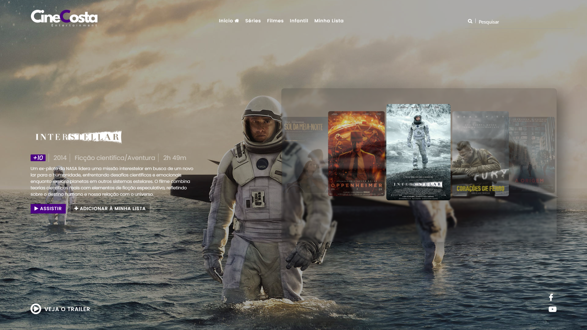

<code></code> 
# Projeto Frontend Streaming Moderno de Filmes 🍿

<code></code> 

## Tecnologias Utilizadas:
- HTML
- CSS
- JavaScript
- Materialize
- jQuery

## Descrição do Projeto:
Este é um projeto de streaming de filmes, onde o foco foi praticar o frontend com JavaScript, HTML, CSS e algumas bibliotecas extras para animações, como o Materialize.

### Principais Objetivos:
- Treinar responsividade com HTML, CSS e JavaScript puro.
- Implementar um carrossel animado com Materialize.
- Adicionar animações utilizando CSS.

## Como Clonar o Projeto:
1. Crie uma pasta no local onde você deseja que ele fique em sua máquina.
2. Utilize o comando `git clone <link do repositório>` para clonar o projeto.

```
git clone https://github.com/gabrielcostaaa/cinecosta.git
